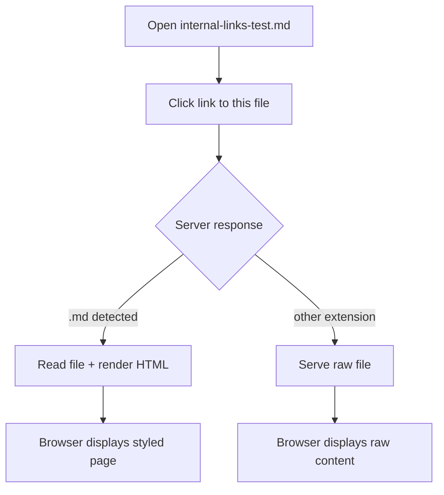

# Linked Document Test

This file is the target of links from [internal-links-test.md](./internal-links-test.md). If you see rendered HTML with styles and heading anchors, server-side `.md` rendering is working.

## Features

This section is the target of a fragment link (`./linked-doc-test.md#features`). If the browser scrolled here automatically, anchor navigation on linked documents works correctly.

Capabilities verified by reaching this file:

* Server detected the `.md` extension and rendered HTML instead of serving raw Markdown
* `wrapHtmlDocument()` applied the full HTML template (styles, CSP, Mermaid script)
* Frontmatter was extracted and rendered as a table above the content
* Heading IDs were generated for anchor scrolling

## Mermaid in Linked Documents

Mermaid diagrams in linked documents should render automatically because `mermaid-init.mjs` fires on every page load.



## Relative Links from This File

Links in this document are relative to its own directory. The browser resolves them correctly because the server serves rendered HTML at the same URL path as the `.md` file.

* [Back to main test](./internal-links-test.md)
* [Mermaid test](./mermaid-test.md)
* [Section in main test](./internal-links-test.md#features)
* [Own anchor: Back References](#back-references)
* [Own anchor: Top](#linked-document-test)

## Back References

This section is the target of a fragment link from the main test file. Use the links above to navigate back.

## Code Block Test

Non-Mermaid code blocks should render as syntax-highlighted code, not as diagrams.

```json
{
  "name": "linked-doc-test",
  "version": "1.0.0",
  "description": "Test file for internal link navigation"
}
```

## Heading Edge Cases

### Heading with **bold** and *italic*

Emphasis markers should be stripped from the slug, keeping only the text content.

### Heading with special chars: dots... & ampersands!

ASCII punctuation should be removed from the slug.

### 日本語の見出し

CJK characters should be preserved in the slug.
