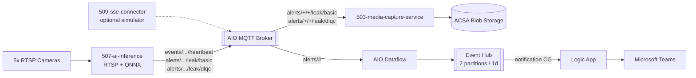
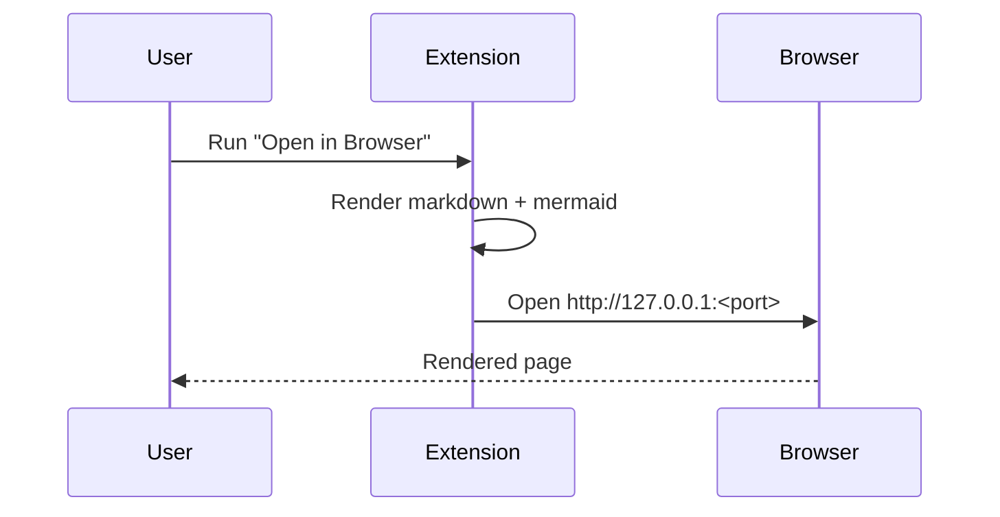
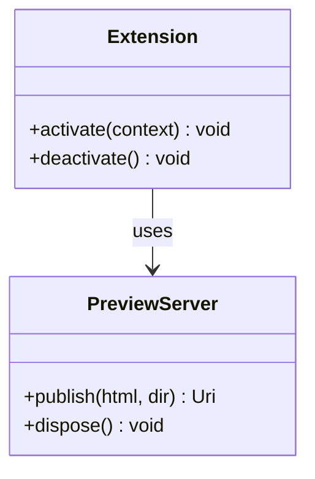
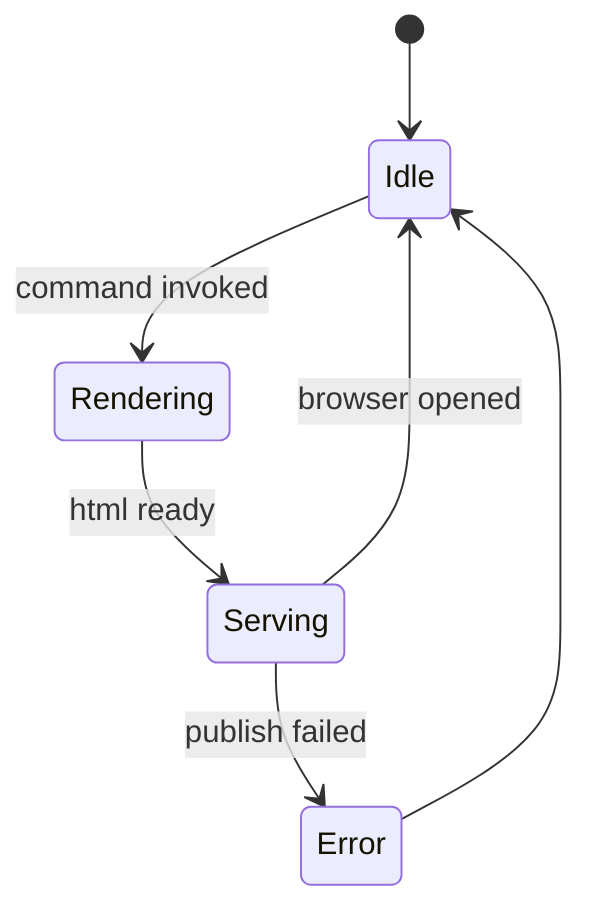
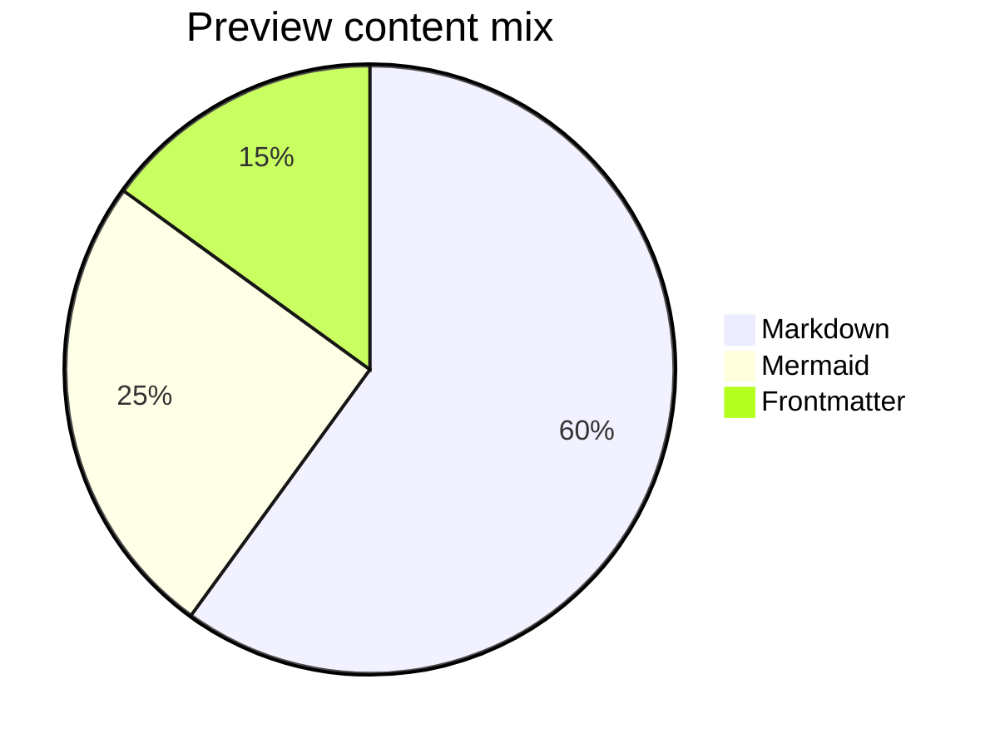
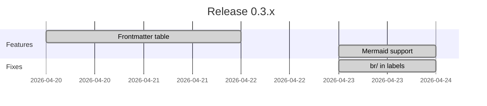

# Mermaid Rendering Test

Open this file in the browser via **Markdown: Open in Browser** (`Ctrl+Shift+Alt+V`) to verify mermaid rendering.

## 1. Flowchart with `<br/>` line breaks in labels



## 2. Sequence diagram



## 3. Class diagram



## 4. State diagram



## 5. Pie chart



## 6. Gantt chart



## 7. Non-mermaid fenced block (should remain a code block)

```ts
const answer: number = 42;
console.log(answer);
```
